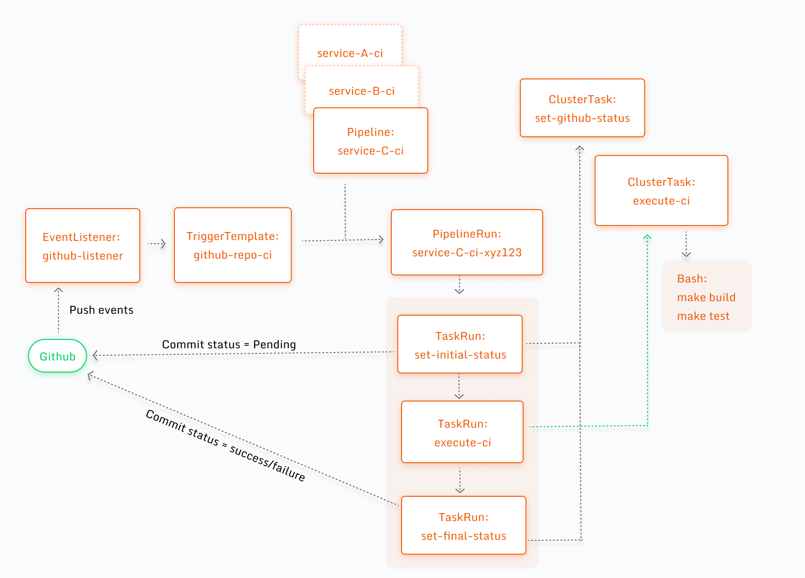

# tekton-ci-starter

This is a collection of resources to setup a basic CI pipeline for a GitHub repository on Tekton.

This is a subset of the Tekton setup at Grofers and we hope that it helps someone getting started with running Tekton in a way that we are doing. The following diagram might help with some high-level details about this setup -



## Setup

### Pre-requisites

A kubernetes cluster with the following CRDs -

1. Tekton (v0.23.0)
2. Tekton Triggers (v0.12.1)

After the pre-requisites are met - 
1. You'll need to populate `secret-github.yaml` with your own values
2. Apply all the manifests inside `k8s/` directory

## Usage

This tutorial will get you started with a very basic CI pipeline for your project and also help you become aware of Tekton CD.

### 1. Setup your environment

This tutorial assumes some pre-requisites being already met. Please ensure the following is in place -

   1. You have access to kubernetes cluster
   2. You have kubectl (v1.18+) installed locally 
   3. You have kustomize (v3.8+) installed locally (version=3.8.5)

### 2. Spec out your `hello-world` pipeline

We'll use kustomize to build our basic pipeline. Create the file `.ci/kustomization.yaml` with following content in your project -

```yaml
bases:
    - https://github.com/grofers/tekton-ci-starter/ci-base?ref=master

namePrefix: my-service-
```

The value of `namePrefix` should be your repo name on Github followed by a hyphen.

**NOTE**: If you plan to use remote base like above in your project, it's recommended that you either fork this repo or copy the base in your own repo.

**NOTE**: Ensure you follow the DNS-1123 naming convention for name-prefix i.e. a DNS-1123 subdomain must consist of lower case alphanumeric characters, '-' or '.', and must start and end with an alphanumeric character (e.g. 'example.com', regex used for validation is `'[a-z0-9]([-a-z0-9]*[a-z0-9])?(\.[a-z0-9]([-a-z0-9]*[a-z0-9])?)*'`). So if your repo-name has these chars replace it with (`-`) hypens. 

### 3. Create your pipeline using kubectl

`kustomize build .ci | kubectl apply -f -`

### 4. Test your pipeline by creating a pull request

Once you open a pull request in your project, you'll see a status checks with name `my-service-ci` appear on the PR.

## Need help or have feedback?

If you tried using these instructions and manifests but did not achieve a desired result then please open a GitHub issue.

If you have some feedback or would like to discuss some enhancements, then please open a GitHub issue or a pull request.
